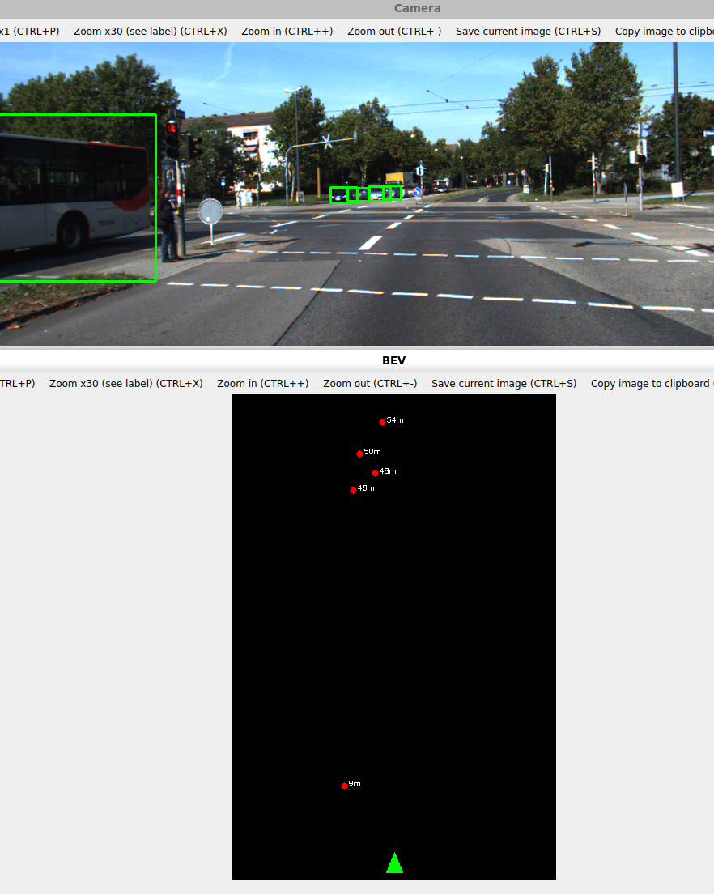

TODO:
actual VO, motion estimation, scale handling, SORT, ego compensation, history tails

1. Download KITTI Dataset, off multi-object-tracking page; download - camera calibration, left color camera, and labels
2. Extract all 3 into a data folder so that it looks like data/testing and data/training
3. Install Dependencies OpenCV 4.x, QT6Widgets, and a C++17 compiler
To run:
```
# 4. Create build directory
mkdir build && cd build
# 5. Configure and Compile
cmake ..
make
```

scale can be very off as no VO has been implemented yet to calculate with pitch in mind

